# find-the-ship

Toy dataset for machine vision education and experimentation

<table align="center">
  <tr>
    <td>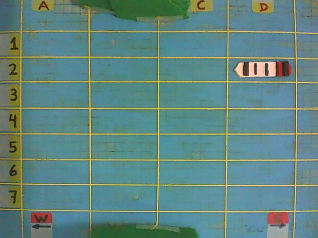</td>
    <td>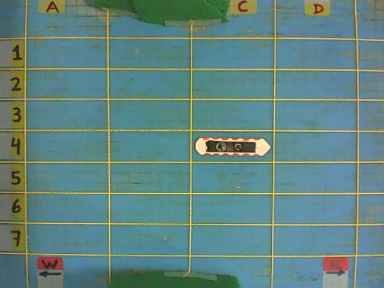</td>
    <td>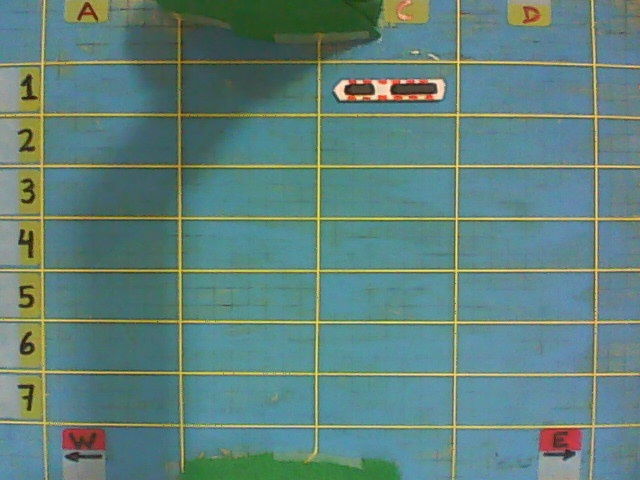</td>
  </tr>
  <tr>
    <td>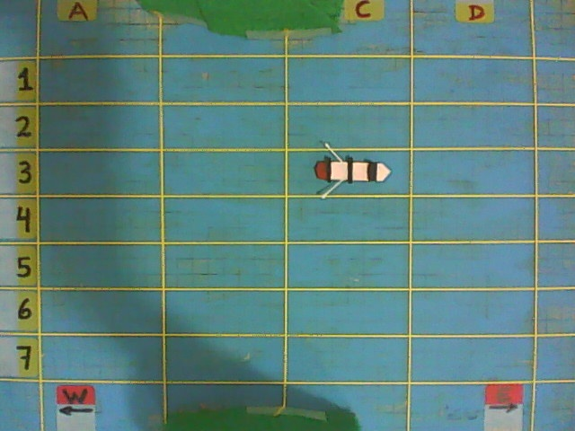</td>
    <td>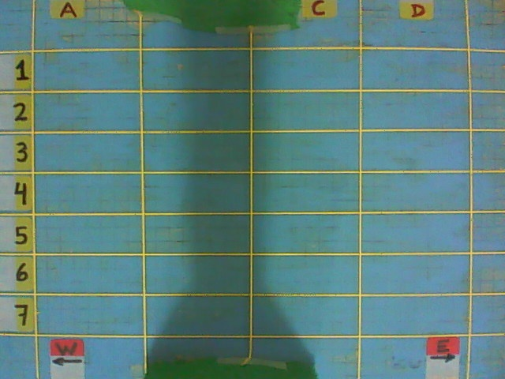</td>
    <td>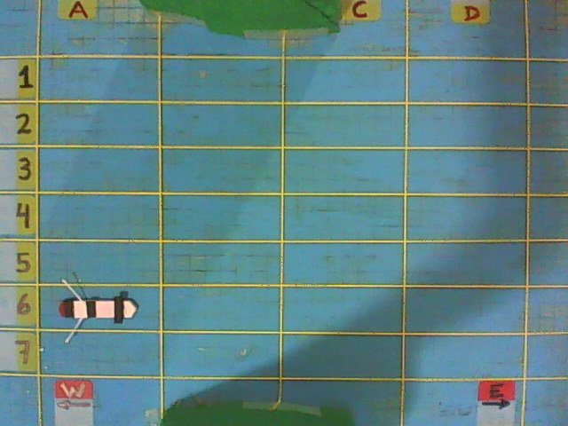</td>
  </tr>
  <tr>
    <td>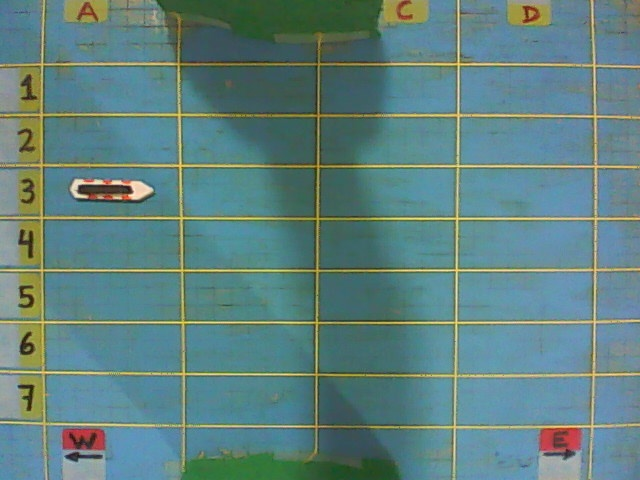</td>
    <td>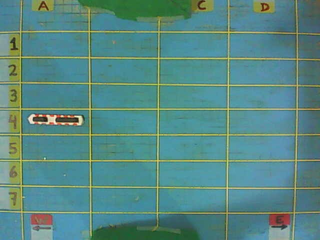</td>
    <td>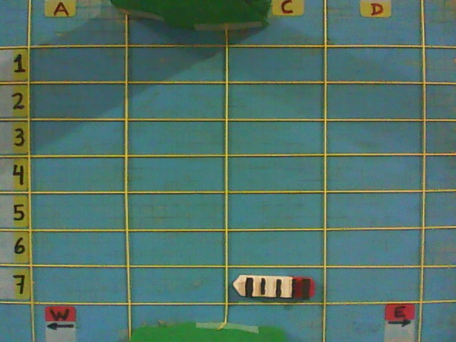</td>
  </tr>
</table>

This is a multi-task classification dataset I made for fun in late 2017 using a cheap webcam, wood, glue, paint, yarn and scotch tape. It consists of 2035 images of a board representing a ficticious ocean area where 6 ship models operate. Every image is 640 x 480 pixels with three color channels (RGB). Each non-empty image sample contains exactly one scaled model of a ship with a particular location and heading. The tasks are:
* **1.** Determine whether or not the image is non-empty (i.e., contains a ship).
* **2.** If the image is non-empty:
  * **A.** Determine the ship's location.
  * **B.** Determine the ship's heading.
  * **C.** Determine the ship's model.

The data split is as follows:
* Directory [`/set-A_train`](https://github.com/luis-i-reyes-castro/find-the-ship/tree/main/set-A_train) contains 1635 image samples for training
* Directory [`/set-B_test`](https://github.com/luis-i-reyes-castro/find-the-ship/tree/main/set-B_test) contains 400 image samples for testing (validation)

Needless to say, you may choose any other data split you find useful for your purposes. 

## Board

The board consists of 28 locations, with rows ranging from 1 through 7 and columns ranging from A through D. Each non-empty image sample contains exactly one ship, and the ship may be facing either West (towards the left of the board) or East (towards the right of the board). The following image sample shows an empty board with each location labeled. 

  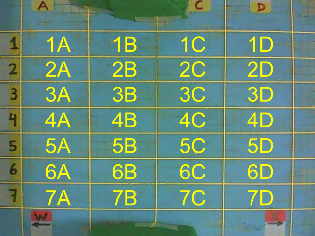

## Ship Models

Each non-empty image sample contains exactly one of six possible ship models, facing either West (towards the left of the board) or East (towards the right of the board). The following table displays sample images of each ship model. 

<table align="center">
  <tr>
    <th>Sample Image</th>
    <th>Ship Model</th>
    <th>Shown Facing</th>
  </tr>
  <tr>
    <td>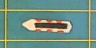</td>
    <td><b>Cruiser-1</b></td>
    <td>West</td>
  </tr>
  <tr>
    <td>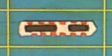</td>
    <td><b>Cruiser-2</b></td>
    <td>East</td>
  </tr>
  <tr>
    <td>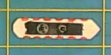</td>
    <td><b>Cruiser-3</b></td>
    <td>East</td>
  </tr>
  <tr>
    <td>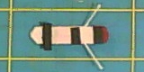</td>
    <td><b>Fishing-1</b></td>
    <td>West</td>
  </tr>
  <tr>
    <td>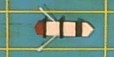</td>
    <td><b>Fishing-2</b></td>
    <td>East</td>
  </tr>
  <tr>
    <td>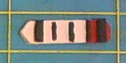</td>
    <td><b>Freighter</b></td>
    <td>West</td>
  </tr>
</table>

## Image Labels

The image labels can be found in the `image_labels.csv` files inside each dataset directory. These CSV files contain tables where each row corresponds to an image sample. The columns are structured are as follows.

<table align="center">
  <tr>
    <th>Column</th>
    <th>Values</th>
  </tr>
  <tr>
    <td><b>Filename</b></td>
    <td>Filename as is.</td>
  </tr>
  <tr>
    <td><b>Is_nonempty</b></td>
    <td>1 if the image sample is non-empty; 0 otherwise.</td>
  </tr>
  <tr>
    <td><b>Location</b></td>
    <td>If the image is non-empty, ship location row (1,2,3,4,5,6,7) and column (A,B,C,D); blank otherwise.</td>
  </tr>
  <tr>
    <td><b>Heading</b></td>
    <td>If the image is non-empty, ship heading (West or East); blank otherwise.</td>
  </tr>
  <tr>
    <td><b>Ship</b></td>
    <td>If the image is non-empty, ship model: Cruiser-1, Cruiser-2, Cruiser-3, Fishing-1, Fishing-2 or Freighter; blank otherwise.</td>
  </tr>
</table>

The following is an example of the data contained in the `image_labels.csv` files.

<table align="center">
    <tr>
        <th>Filename</th>
        <th>Is_nonempty</th>
        <th>Location</th>
        <th>Heading</th>
        <th>Ship</th>
    </tr>
    <tr>
        <td>20171105_185402_Empty.jpg</td>
        <td>0</td>
        <td></td>
        <td></td>
        <td></td>
    </tr>
    <tr>
        <td>20171105_185419_Location-1B_Heading-East_Ship-Fishing-1.jpg</td>
        <td>1</td>
        <td>1B</td>
        <td>East</td>
        <td>Fishing-1</td>
    </tr>
    <tr>
        <td>20171105_185451_Location-4C_Heading-East_Ship-Cruiser-1.jpg</td>
        <td>1</td>
        <td>4C</td>
        <td>East</td>
        <td>Cruiser-1</td>
    </tr>
    <tr>
        <td>20171105_185533_Location-2D_Heading-West_Ship-Freighter.jpg</td>
        <td>1</td>
        <td>2D</td>
        <td>West</td>
        <td>Freighter</td>
    </tr>
    <tr>
        <td>20171210_171214_Location-1B_Heading-West_Ship-Cruiser-3.jpg</td>
        <td>1</td>
        <td>1B</td>
        <td>West</td>
        <td>Cruiser-3</td>
    </tr>
    <tr>
        <td>20171210_171245_Empty.jpg</td>
        <td>0</td>
        <td></td>
        <td></td>
        <td></td>
    </tr>
    <tr>
        <td>20171210_171343_Location-6A_Heading-East_Ship-Cruiser-2.jpg</td>
        <td>1</td>
        <td>6A</td>
        <td>East</td>
        <td>Cruiser-2</td>
    </tr>
    <tr>
        <td>20171210_171430_Location-2B_Heading-East_Ship-Fishing-2.jpg</td>
        <td>1</td>
        <td>2B</td>
        <td>East</td>
        <td>Fishing-2</td>
    </tr>
</table>

Alternatively, you can also write a parser script to read the image labels directly from their corresponding filenames. All image filenames are prefixed with a `YYYYMMDD_HHMMSS_` string indicating the date and time of the image creation in YYYY-MM-DD format and HH:MM:SS format, respectively. 

## Examples

You can find example Python scripts in the [`/examples`](https://github.com/luis-i-reyes-castro/find-the-ship/tree/main/examples) directory. These scripts were written in late 2017 to early 2018, so they are probably deprecated by now (2025). Back then I used a multi-head Convolutional Neural Network (CNN) written in Keras, which you can find implemented as the [`DetectorCNN`](https://github.com/luis-i-reyes-castro/find-the-ship/blob/main/examples/detectorcnn.py#L25) class in the [`/examples/detectorcnn.py`](https://github.com/luis-i-reyes-castro/find-the-ship/blob/main/examples/detectorcnn.py) script. This model has an output head for each task, where the first head outputs the probability that the image is non-empty and the four other heads output probability vectors for the ship model, row, column and heading. Unfortunately, I forgot to upload the model weights and to report the best model accuracy, so sorry about that.

## Tips and Challenges

A couple tips:
* You can crop the original images to remove irrelevant areas by throwing away all pixels with rows outside the range 60 to 430 or columns outside the range 40 to 600. You can find these ranges declared in lines 15-18 of the [`/examples/dataset_constants.py`](https://github.com/luis-i-reyes-castro/find-the-ship/blob/main/examples/dataset_constants.py) script.
* You do not need to use the color channels to build a decent model, or at least I did not. You can see this in line 120 of the [`load_samples`](https://github.com/luis-i-reyes-castro/find-the-ship/blob/main/examples/utilities.py#L94) function in [`/examples/utilities.py`](https://github.com/luis-i-reyes-castro/find-the-ship/blob/main/examples/utilities.py), where I loaded the images in grayscale using Scipy's `imread` function with `flatten = True`. Be aware that Scipy has deprecated `imread`, which is now part of the [`imageio`](https://imageio.readthedocs.io/en/stable/) package.

Some of the challenges of this dataset:
* The Fishing-1 and Fishing-2 ship models are sometimes hard to tell apart. During the dataset construction I found that I had to write numbers at the bottom of the models to tell them apart. Thus, the dataset may contain be a few image samples mislabeled as Fishing-1 that actually correspond to Fishing-2, and vice-versa. Nevertheless, my [`DetectorCNN`](https://github.com/luis-i-reyes-castro/find-the-ship/blob/main/examples/detectorcnn.py#L25) model managed to predict the correct ship model most of the time.
* The heading of Cruiser-2 is sometimes hard to tell because of the geometry of the model.

## Exercises

Here are some exercise ideas. For each exercise, consider the exercise successfully completed if you can satisfy all four classification tasks with at least 95% accuracy. For the last two exercises, you may want to try using the color channels.
1. Build any model that gets the job done.
2. Build the _smallest_ model that gets the job done. Here, by _smallest_ we mean the least number of trainable parameters, but not necessarily the least number of trainable layers.
3. Build the _shallowest_ model that gets the job done. Here, by _shallowest_ we mean the least number of trainable layers, which is not necessarily the same as the least number of trainable parameters.

## Dataset Construction

The dataset was constructed using the [`/examples/sample_generator.py`](https://github.com/luis-i-reyes-castro/find-the-ship/blob/main/examples/sample_generator.py) script. The script prompted me to either take an image of a ship with probability between 0.75 and 0.86, or take an empty image with probability between 0.14 and 0.25. When taking an image of a ship, all six ship models were selected with the same probability; the same with the ship row, column and heading. Finally, the image was sent to the training directory with probability of 0.80 or to the test directory with a probability of 0.20. Throughout the dataset construction process I varied the lighting by turning on and off different light bulbs in the room and rotating the board. This was done to enrich the data, which is why you can see the camera supports casting shadows in different directions, as well as the board being illuminated with different intensities. The test rig is shown below.

  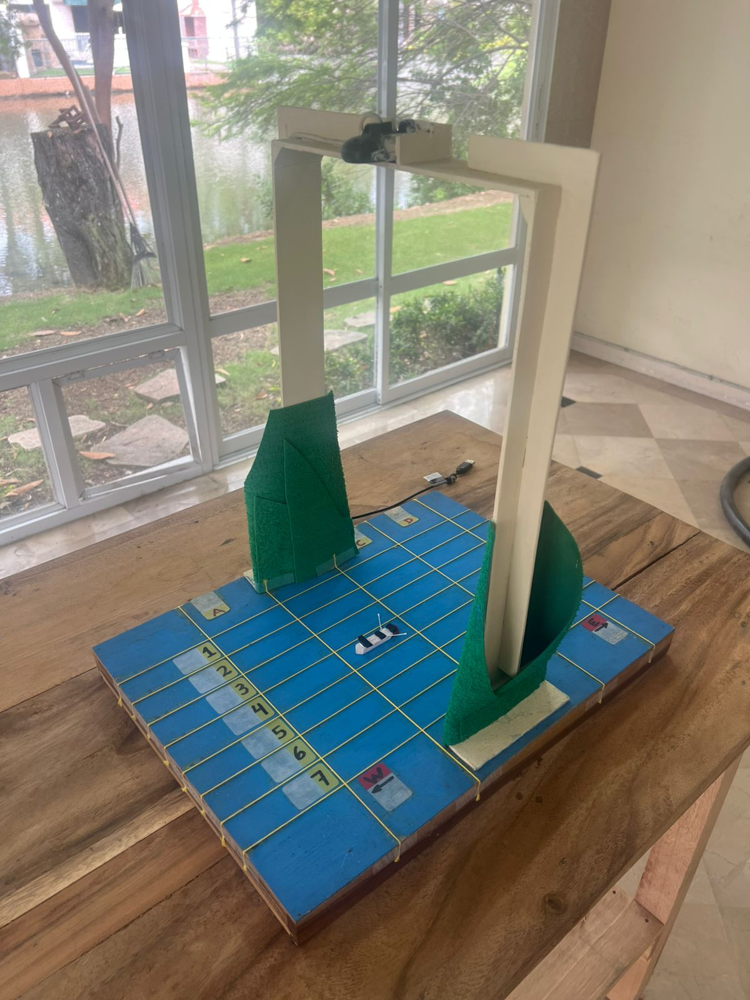

## Contact

I hope you have as much fun as I did playing with this dataset. For suggestions, comments or questions you can email me at `luis.i.reyes.castro@gmail.com`. In case you download this dataset from Kaggle, you can find the original repository [here](https://github.com/luis-i-reyes-castro/find-the-ship).
